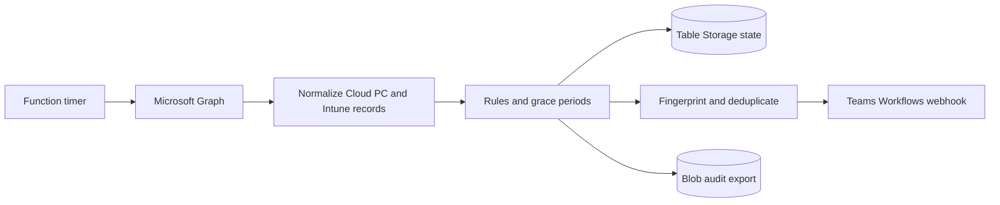

# Architecture

The first milestone is a read-only monitoring service. It collects supported Microsoft Graph data, evaluates local rules, records durable state, optionally posts a Teams card, and writes a compact JSON audit export.

## Components

| Component | Responsibility | Identity or boundary |
| --- | --- | --- |
| Azure Function | Hourly timer, Graph collection, rule evaluation, notification orchestration | System-assigned managed identity |
| Microsoft Graph | Cloud PC inventory/status, Intune managed-device state, optional recommendation report | Application roles assigned to the Function identity |
| Table Storage | Alert fingerprints, grace-period observations, acknowledgements, notification timestamps, latest run summary | Storage data-plane RBAC on the dedicated account |
| Blob Storage | Compact JSON audit reports | Private container; lifecycle deletion is configured by Bicep |
| Teams Workflows | Receives an Adaptive Card webhook and posts to an operator-selected channel | URL is an operator-supplied bearer-style secret |
| Application Insights / Log Analytics | Function and collection diagnostics | Azure resource telemetry |

## Collection boundary

The default `GRAPH_API_VERSION=beta` is intentional for the first milestone because the current Cloud PC resource contract exposes status, connectivity, and last-login fields there. The service falls back to no destructive behavior if a nonessential collection fails: managed-device or recommendation failures are recorded as warnings, while failure to list Cloud PCs fails the invocation so it cannot silently report an empty tenant.

The optional recommendation report uses the documented `POST /deviceManagement/virtualEndpoint/report/retrieveCloudPcRecommendationReports` action. It is disabled by default because Microsoft currently documents `CloudPC.ReadWrite.All` as the least-privileged application permission for that report action, even though this implementation only consumes the returned report. Enabling it is a separate permission decision.

The implementation follows the current Microsoft documentation for [tenant Cloud PC listing](https://learn.microsoft.com/en-us/graph/api/virtualendpoint-list-cloudpcs?view=graph-rest-1.0), the [beta Cloud PC resource](https://learn.microsoft.com/en-us/graph/api/resources/cloudpc?view=graph-rest-beta), [managed-device listing](https://learn.microsoft.com/en-us/graph/api/intune-devices-manageddevice-list?view=graph-rest-1.0), and the [Cloud PC recommendation report](https://learn.microsoft.com/en-us/graph/api/cloudpcreport-retrievecloudpcrecommendationreports?view=graph-rest-1.0). Beta fields are a deliberate compatibility boundary and should be rechecked before a production rollout.

## Alert lifecycle

1. Each candidate condition gets an observation key of `rule-id:cloud-pc-id`.
2. The first observation is persisted in Table Storage; a configured grace period must elapse before notification.
3. Once eligible, the rule and Cloud PC ID form a stable SHA-256 fingerprint. Evidence can change without creating a duplicate alert.
4. Acknowledged alerts remain in state and are skipped by the notifier. A future acknowledgement workflow can update the durable record without changing the collector.
5. New alerts and alerts past `NOTIFICATION_RENOTIFY_HOURS` are sent. Successful delivery updates notification history; failed delivery remains eligible for a later retry.
6. Conditions absent from a later complete evaluation are marked inactive and their grace-period observation is cleared.

No rule calls a Cloud PC write endpoint. The report explicitly records that remediation was not executed.
